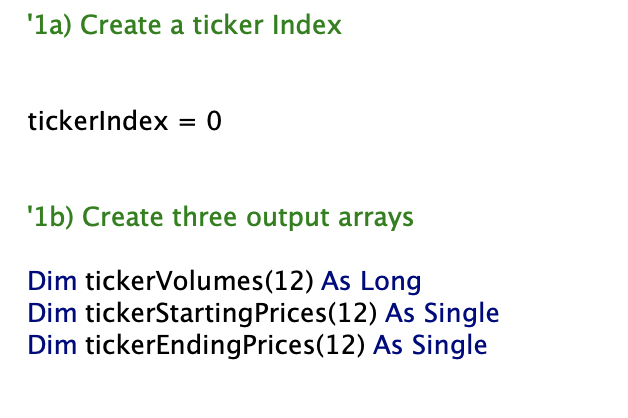
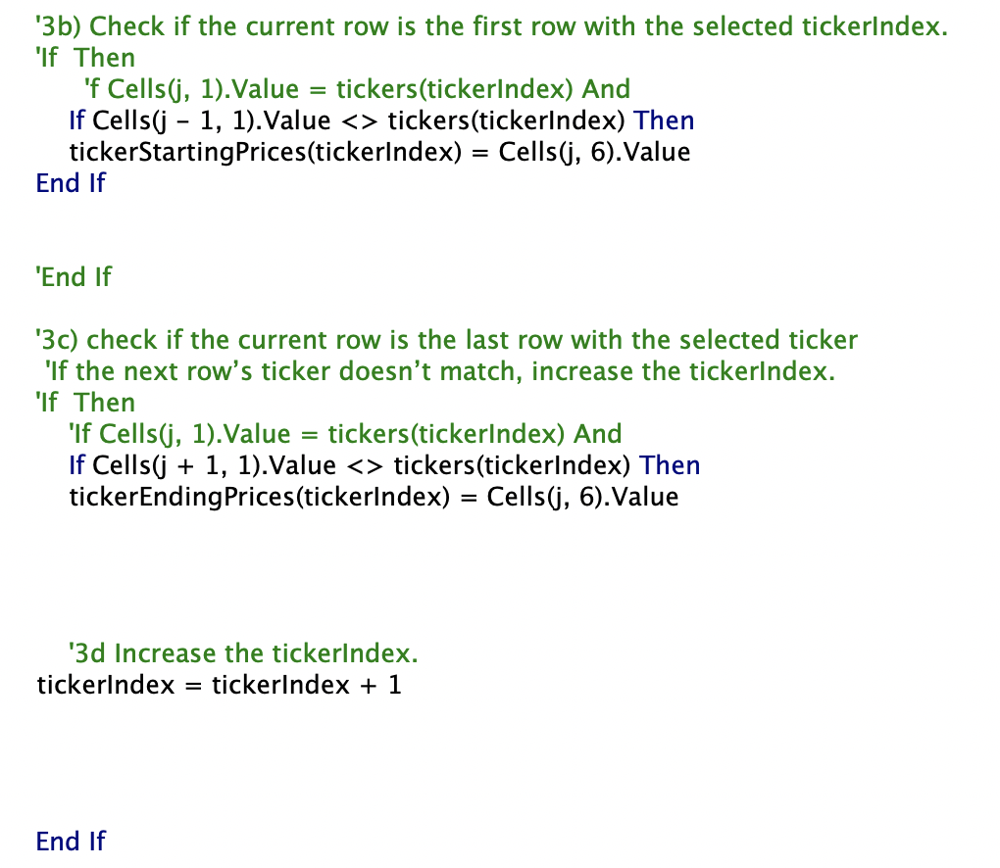
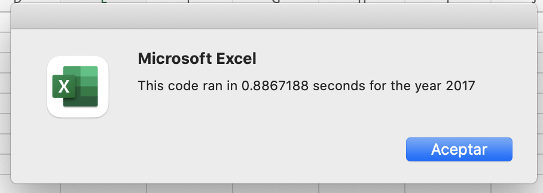
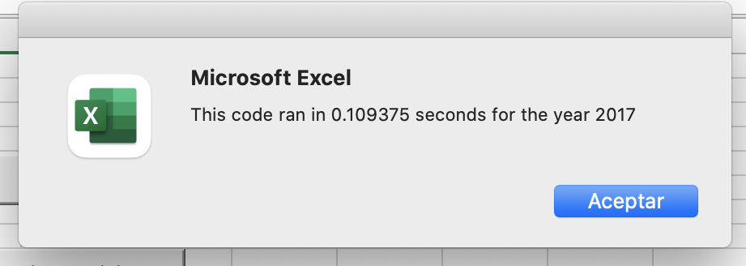

# VBA of Wall Street 

## Overview of Project

The purpose of this activity is to Analyze stocks data to determine whether  Steve's parents should stick with their decision of investing everything in the "DQ" stock or if they should diversify and invest in different stocks. And let them know which stocks would be the better options.

## Stock comparison performance between 2017 and 2018.

After analyzing and formatting the data, what we can see at first glance is that all the stocks did much better in 2017 than in 2018. In 2017 there was only one stock with negative numbers. All the others had positive returns, including "DQ" which had the best return of all with almost a 200% increase. If things had stayed the same, maybe Steve's parents putting all their money in "DQ" would have been a good idea.

But as we continue with the analysis for 2018 things change drastically. All but two of the stocks have negative returns. This includes "DQ" which tells us that investing everything in green energy might not be the safest bet, especially if you invest everything in the same stock. So Steve's parents should start diversifying their investments.

# Code performance comprising between the original script and the refactored script.

At first, we wrote a code that looped throw every stock three times: Once to get the volume, once to get the starting price, and once to get the ending price. This worked fine but made the analysis slower which for larger data sets would be a problem. 

So to make the code run faster and make it more efficient in case Steve needs to use it to analyze a larger dataset we refactored. What we did was tell the code to loop throw every stock just once and collect the three values at the same time. This made our code faster and more efficient.

To achieve this, we created three new arrays, one for every value we were looking for: 

And a ticker index that increase every time the ticker changed:

# What are the advantages or disadvantages of refactoring code?

The principal advantage of refactoring code that we learned here is the running time. Once we refactored it we made it much faster and easier to work with large datasets. Another advantage that I can see is that we ended up with a clearer code, easier for other people to understand.

One of the disadvantages of refactoring code that I could see in this challenge was that it can take a lot of time and sometimes it is better to leave the code if it is working because you can spend a lot of time refactoring it for the same result.

# How do these pros and cons apply to refactoring the original VBA script?

As I mention the biggest pro in refactoring our VBA code was the time. The analysis with the refactored code ran almost four times faster than the original. As we can see in the images below.

The con is that with the original code we already had all the information we needed for Steve's parents' stock analysis recommendations. So the extra time we spend refactoring wasn't that necessary 
